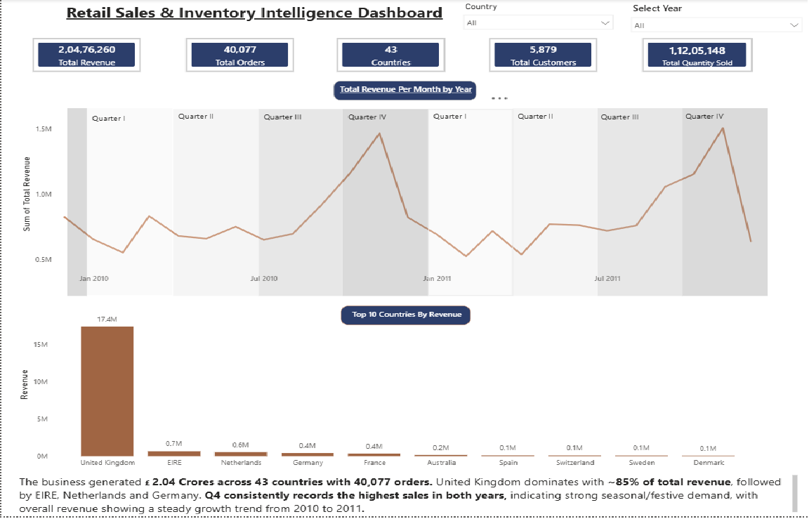
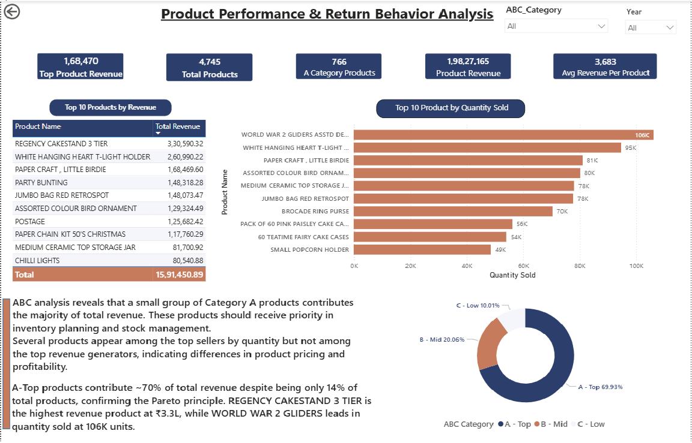
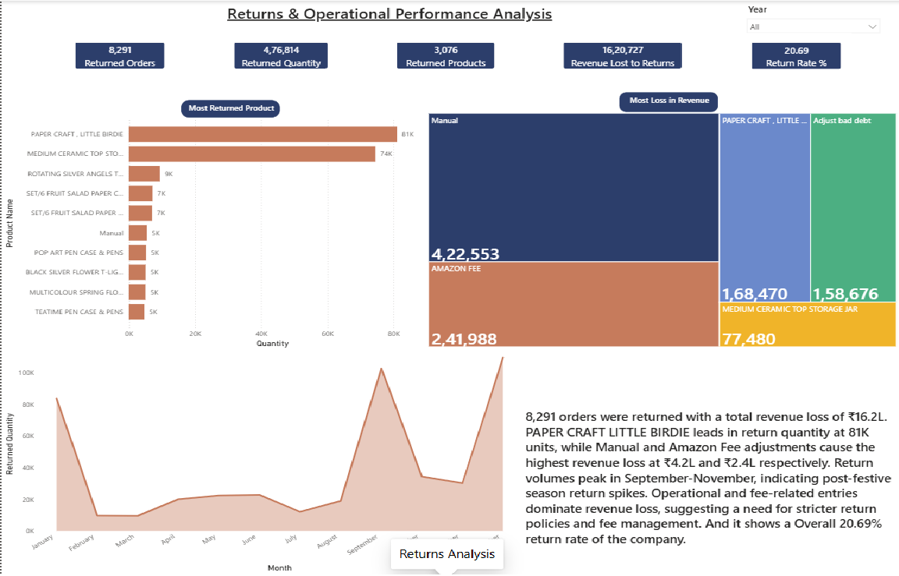
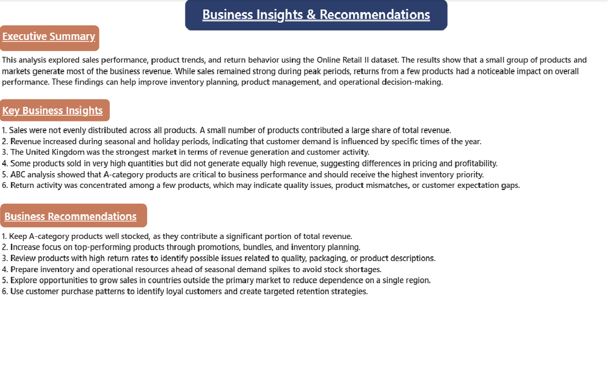

# 🛍️ Online Retail Sales & Product Intelligence Dashboard

---

> Analyzed 500K+ retail transactions to identify ₹16.2L in 
> return-driven revenue loss and surface product concentration 
> risks across a 43-country operation.

## 📌 Business Problem

A UK-based online retailer operates across 43 countries and processes 
thousands of transactions daily. Despite strong revenue numbers, the 
business had no clear visibility into:

- Which products were actually driving profitability vs just volume
- Why return rates were high and which products/periods were responsible
- How dependent the business was on a single market (UK)
- Where operational revenue loss was originating

This project analyzes 500,000+ transactions across 2010–2011 to answer 
these questions and surface actionable recommendations.

---

## 🔑 Key Findings & Business Insights

### 1. Revenue Concentration Risk
The UK market generates ~85% of total revenue (₹17.4M of ₹20.4M).
While this reflects strong home market performance, it represents 
significant geographic concentration risk. The next 4 markets combined
(EIRE, Netherlands, Germany, France) contribute less than 10%.

**Recommendation:** A targeted expansion pilot in EIRE — already showing 
₹0.7M in traction — could meaningfully reduce single-market dependency.

### 2. Return Rate is Eroding 8% of Revenue
- 8,291 orders returned | 4,76,814 units | ₹16.2L revenue lost
- Overall return rate: 20.69%
- Return volumes spike every September–November (post-festive pattern)
- Top return products: PAPER CRAFT LITTLE BIRDIE (81K units), 
  MEDIUM CERAMIC TOP STORAGE JAR (74K units)
- Largest revenue loss source: "Manual" adjustments (₹4.2L) and 
  Amazon Fee entries (₹2.4L) — an operations issue, not a product issue

**Recommendation:** Pre-festive packaging audit on top 5 return products;
stricter fee reconciliation process could recover a portion of ₹16.2L annually.

### 3. ABC Analysis Confirms Pareto Principle
- 766 A-category products = 14% of catalog = 70% of revenue
- Several top-volume products do NOT appear in top-revenue products,
  indicating pricing or margin gaps worth investigating
- REGENCY CAKESTAND 3 TIER: highest revenue product (₹3.3L)
- WORLD WAR 2 GLIDERS: highest volume product (106K units) — 
  low unit price driving volume without proportional revenue

**Recommendation:** Inventory and promotional priority should be 
driven by revenue contribution, not volume alone.

### 4. Q4 Seasonal Demand is Predictable and Significant
Revenue peaks consistently in Q4 both years, with the sharpest 
spike in November. This is a plannable event — not a surprise.

**Recommendation:** Stock buffer for top 10 A-category products 
should be built 6–8 weeks before November based on prior year velocity.

---

## 📊 Dashboard

4-page interactive Power BI dashboard:

### Executive Overview

### Product Performance & ABC Analysis

### Returns & Operational Analysis

### Business Insights & Recommendations

---

## 🛠️ Tools & Methodology

| Tool | Purpose |
|------|---------|
| Python (Pandas, NumPy) | Data cleaning, outlier treatment, feature engineering |
| Matplotlib & Seaborn | Exploratory analysis and distribution visualization |
| MySQL | Structured storage, SQL-based aggregation queries |
| Power BI & DAX | Interactive dashboard, KPI cards, time intelligence |

### Data Cleaning Decisions
- Removed transactions with negative quantities (returns logged separately)
- Excluded records with missing CustomerID for customer-level analysis
- Treated unit prices of 0 as non-revenue transactions (samples/adjustments)
- Standardized country names for geographic aggregation

---

## 📁 Project Structure

├── dataset/       # Cleaned datasets (raw data not included per UCI terms)
├── notebooks/     # Jupyter notebook: EDA and Python analysis
├── sql/           # MySQL queries used for data aggregation
├── dashboard/     # Power BI .pbix file
├── screenshots/   # Dashboard page exports
└── README.md

---

## 📂 Dataset

- **Source:** Online Retail II — UCI Machine Learning Repository
- **Link:** https://archive.ics.uci.edu/dataset/502/online+retail+ii
- **Period:** December 2009 – December 2011
- **Records:** 1,000,000+ raw transactions; ~500K after cleaning

---

## 💡 What I Would Do With More Time

- Build a customer segmentation model using RFM analysis
- Investigate whether high-return products share common 
  attributes (category, price range, country of order)
- Create a return rate forecasting model for operational planning
- Add cohort analysis to track repeat purchase behavior over time
